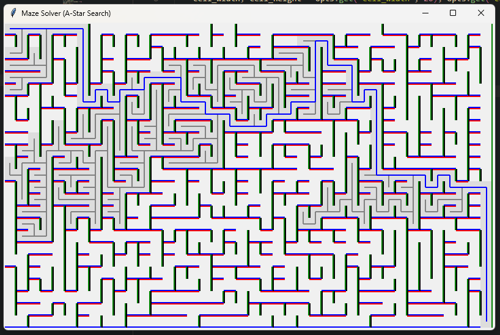

# GUI Maze Solver

A simple maze solver written in Python



To start the maze solver, navigate to the project directory and run the following line in your terminal:

```sh
python main.py
```

By default, the maze solver will use depth-first search to find a path from the top left corner of the maze to the bottom right corner of the maze. You can change the algorithm used by providing an alternative algorithm as a command line argument:

```sh
python main.py -a astar
```

## CLI Options

- `-a | --algorithm`: Specify the algorithm to use when solving the maze. Values include:
  - `astar`
  - `dfs`
  - `bfs`
- `-c | --cell-width`: Specify the pixel width of each cell in the maze
- `-d | --delay`: Specify the time to wait between steps of the maze solving visualizations
- `-h | --help`: Display the help screen
- `-H | --height`: Specify the height of the GUI window
- `-W | --width`: Specify the width of the GUI window
